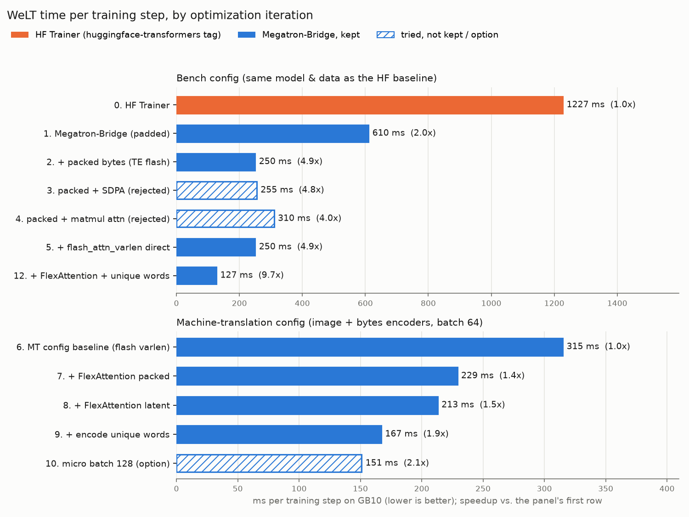

# Benchmarks

All numbers are on a single NVIDIA GB10 (DGX Spark: unified LPDDR5x memory, ~95 TFLOP/s measured bf16 matmul peak).
The GB10 is memory-bandwidth bound, so on e.g. H100s the relative gains of each optimization may differ.

## Time per training step



[`step_time.csv`](step_time.csv) lists every iteration, including the attempts that were not kept.
Regenerate the chart with `python benchmarks/plot.py`.

### Bench config: HuggingFace Trainer vs. Megatron-Bridge

Same model sizes and data in both stacks:
`Helsinki-NLP/opus-100` en-he, packed to 128 words per example, 32 bytes per word, micro batch 32, bf16,
a 10-layer 256-wide bytes encoder, a 6-layer 512-wide latent transformer, and a `sbintuitions/tiny-lm`-shaped
bytes decoder, from scratch. Time per step is the steady-state mean (after warmup).

| Stack | ms / step | Speedup | Model TFLOP/s |
|-------|----------:|--------:|--------------:|
| HF Trainer (`main`, [`hf_baseline/`](hf_baseline)) | 1227 | 1.0x | 2.3 |
| Megatron-Bridge (this PR, [`welt-bench.yaml`](welt-bench.yaml)) | 127 | **9.7x** | 21.8 |

Both learn comparably: after 300 steps the per-byte loss is 0.92 for HF (mean of steps 251-300, linear LR decay)
and 0.86 for Megatron-Bridge (mean of steps 291-300, cosine LR decay).
The HF baseline encodes bytes with a BERT encoder, Megatron-Bridge with a Llama-like bidirectional encoder of the same size.

Reproduce:

```shell
# This PR
torchrun --nproc_per_node=1 -m welt_training.train benchmarks/welt-bench.yaml
# HF baseline, in a checkout of main (bench_hf.py adds a timing callback to the WeLT Trainer)
python benchmarks/hf_baseline/bench_hf.py benchmarks/hf_baseline/hf-bench.yaml
```

### What made it faster

1. **Megatron-Bridge** (2.0x): Transformer Engine layers with fused RoPE / SwiGLU / RMSNorm / cross entropy,
   distributed fused Adam, no HF Trainer overheads.
2. **Packed bytes** (2.4x): the bytes of all words are packed (THD) for the encoders and the decoder, instead of
   padding every word to the longest one in the batch (words average ~7 bytes; padded to 24-32).
3. **FlexAttention** (1.5x on MT): varlen flash attention is slow for tens of thousands of few-token sequences
   (its backward pads each sequence to a 128 tile). FlexAttention with a block mask built in O(tokens) from
   `cu_seqlens` is ~2x faster per layer, and also replaces Transformer Engine's unfused attention for the latent
   transformer's arbitrary (packed + bidirectional shift block) mask.
4. **Encode unique words** (1.3x on MT): the word encoders' output only depends on the word, and only ~31% of the
   words in a batch are distinct, so each distinct word is encoded once and its embedding is shared (exact).

Not kept: padded SDPA / matmul attention for the short sequences (memory-bound on GB10), FP8 (MXFP8 is unsupported on
SM12x; tensorwise FP8 needs token counts padded to multiples of 8, and matmuls are a minority of the step time here).

### Utilization

[`flops.py`](flops.py) counts the FLOPs of each transformer on its real (packed) tokens: "model" FLOPs encode every word
occurrence, "hardware" FLOPs encode each distinct word once.

| Config | ms / step | Model TFLOPs / step | Model TFLOP/s | Hardware TFLOP/s |
|--------|----------:|-------------------:|--------------:|-----------------:|
| Bench | 127 | 2.76 | 21.8 | - |
| Machine translation | 167 | 3.06 | 18.4 | 15.0 |

The remaining time is dominated by memory-bound kernels (SwiGLU, RoPE, norms) of the narrow (128-512 wide)
transformers, which GB10's bandwidth limits. Larger micro batches help a little (batch 128: 10% more samples/s).

## Tasks

[`run_task.sh`](run_task.sh) trains a config, exports it, and evaluates generation with vLLM
([`welt_training/evaluate.py`](../welt_training/evaluate.py): exact match and chrF of completions generated from the
validation prefixes), recording a row of [`tasks.csv`](tasks.csv).

| Task | Steps | ms / step | Train time | Val. byte acc. | Val. word acc. | Gen. exact match | Gen. chrF | Gen. words / s |
|------|------:|----------:|-----------:|---------------:|---------------:|-----------------:|----------:|---------------:|
| **string-repetition**: repeat an English sentence, pretrained tiny LMs * | 1500 | 116 | 3 min | 99.8% | 99.0% | 86.3% | 96.6 | 990 |
| **ocr**: write a sentence seen only as rendered word images * | 3000 | 95 | 5 min | 98.5% | 96.3% | 59.4% | 89.3 | 829 |
| **letter-count**: count the letters of a word | 3000 | 120 | 6 min | 99.7% | 98.9% | 82.8% | 91.7 | 1328 |
| **machine-translation**: English to Hebrew, from scratch, image + bytes encoders | 10000 | 167 | 28 min | 88.5% | 63.2% | 5.1% | 39.2 | 389 |

Generation is greedy, on 256 validation examples, with vLLM (batched over all examples).
\* Trained before FlexAttention and unique-word encoding (iterations 7-9), so their ms / step is higher than current.
